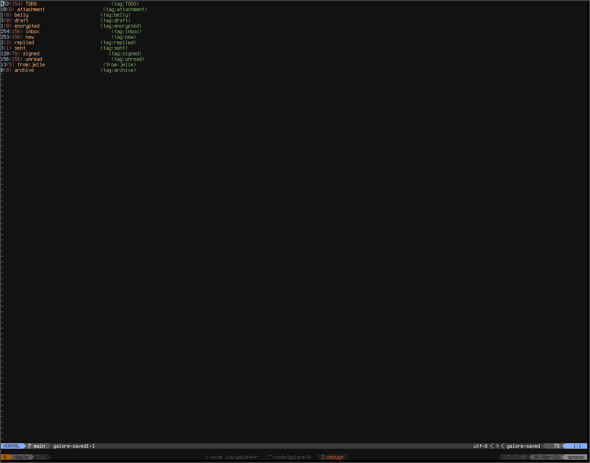
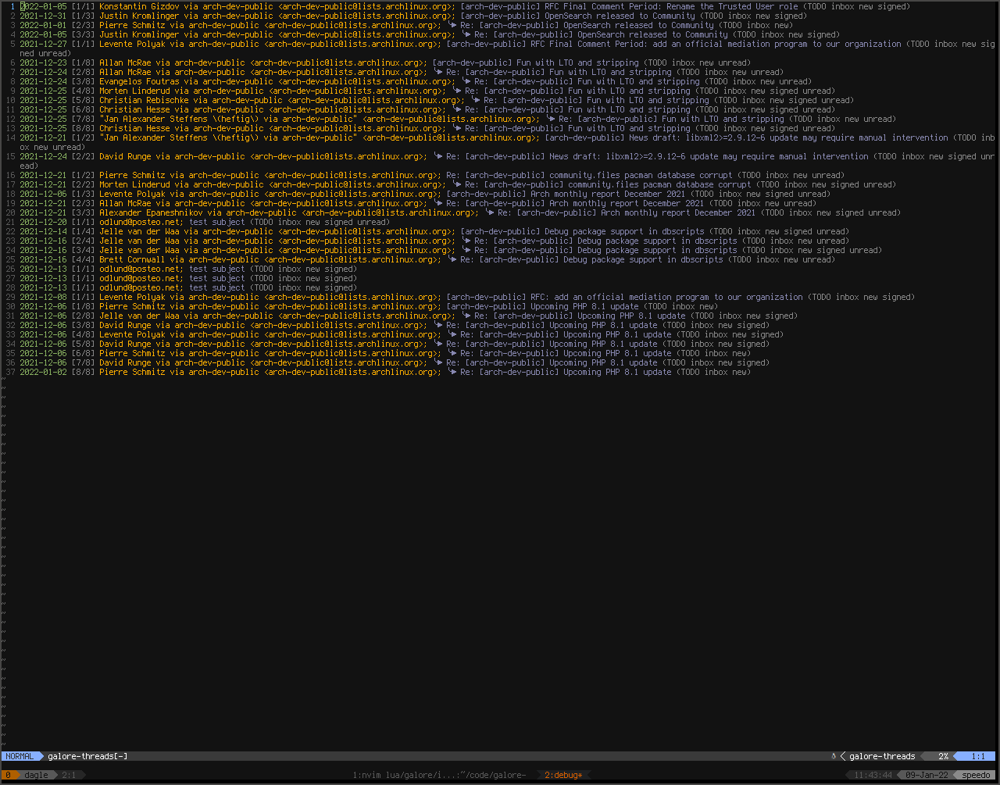
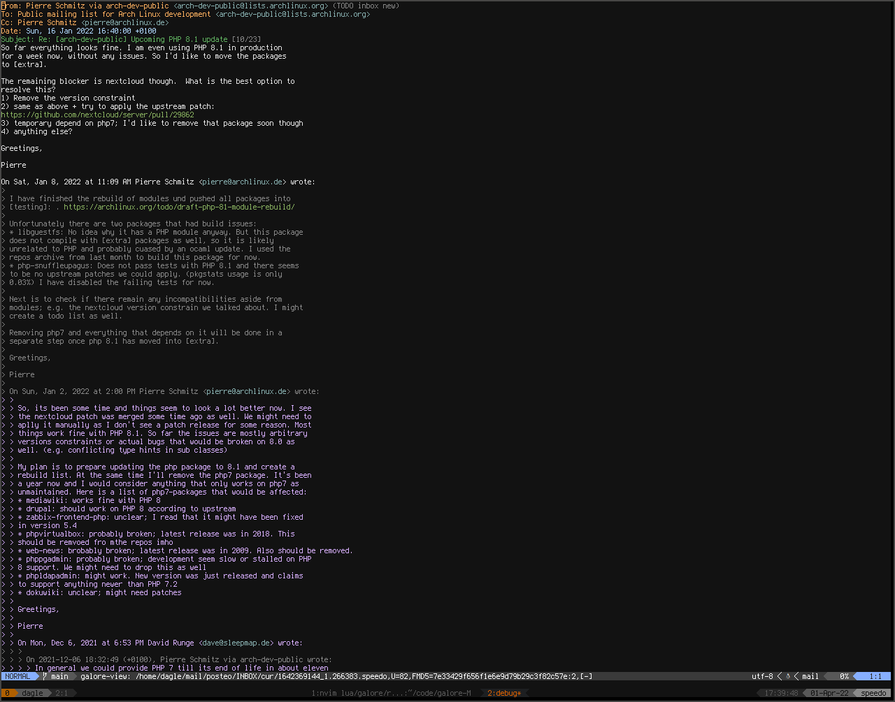
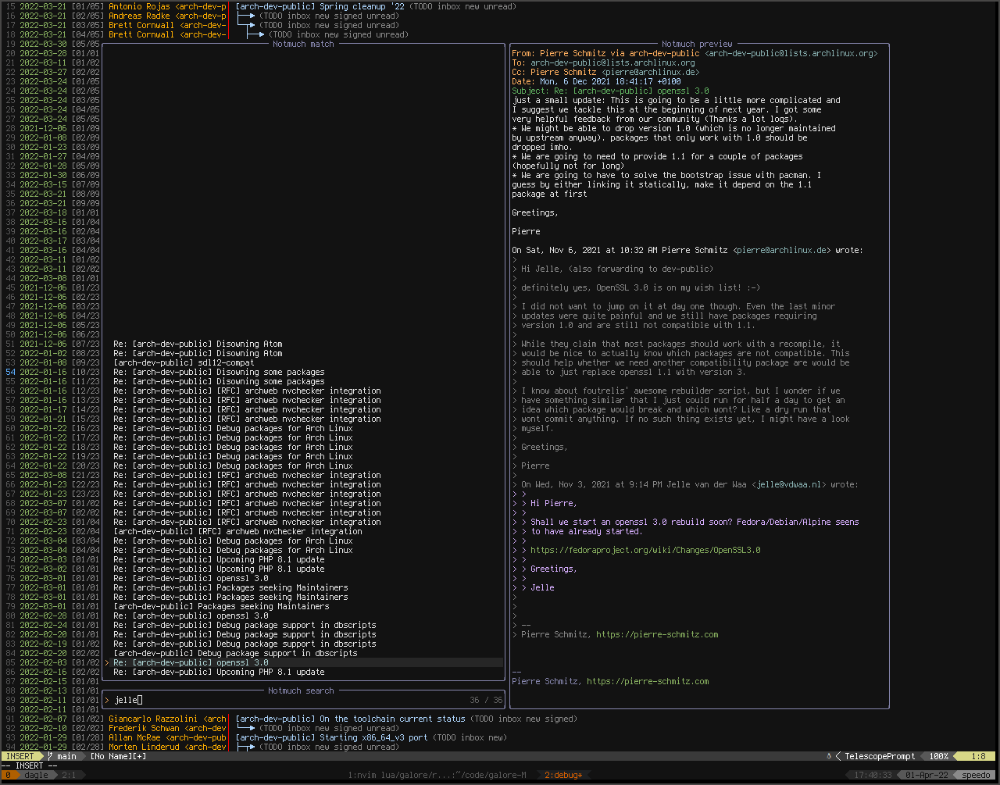
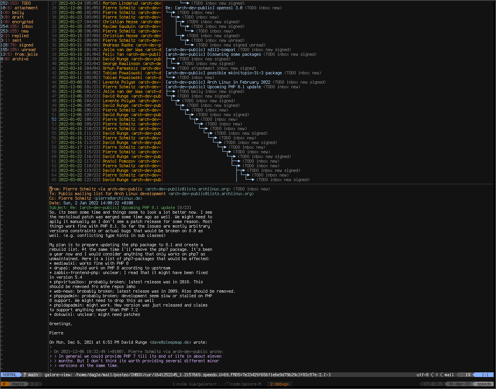

<div align="center">


<a href="https://github.com/neovim/neovim">  </a>

<a href="/LICENSE">  </a>
<a href="#wip">  </a>

# mail galore - A notmuch client for neovim

[Installation](#installation)
•
[Usage](#usage)
•
[Pictures](#pictures)

</div>

## Intro
Notmuch is a great way to index your email and neovim is great for viewing and editing
text. Combine the two and you have a great email client. 
The idea is to be more powerful than mutt but way easier to configure.

Other than the basic notmuch features Galore has support for: 
- cmp for address completion
- telescope for fuzzy searching emails
- encrypting and decrypting emails (multiple engines, autocrypt support(WIP))
- signing and verifying emails

The idea is to provide a good email experiance by default where you configure
every everything to your needs

## Installation
WIP, mail galore is under heavy development, expect crashes and thing changing.
Atm it's pre 0.1 software. If you don't intend to read code / write patches, you should wait.
Galore requires the git branch of neovim or 0.7 to work.

Galore uses luajit and the C-bindings to do its magic, depending on notmuch and gmime.
To view html emails, you need a htmlviewer, by default it uses w3m.

To be able to run qeuries async it uses another program called [nm-livesearch](https://github.com/dagle/nm-livesearch),
it's used to both populate browser windows and telescope. You *need* to install it before using galore

Some html emails are just to impossible to render in galore (or any text email client), for these
you need something more powerful than w3m. For this you can use a tool like
[browser-pipe](https://github.com/dagle/browser-pipe) and then pipe the html into it.
(look in config for an example).

To install these you can do

``` bash
cargo install browser-pipe
cargo install nm-livesearch
```

You need to install neovim and notmuch.

Then using your favorite plugin-manager install galore.

To load the gmime code, we need a loader called [lgi](https://github.com/lgi-devs/lgi).
We can install this package 3 different ways:

- Using the [lgi.nvim wrapper](https://github.com/dagle/lgi.nvim)
- Using a package manager that supports luarocks
- Using [nvim_rocks](https://github.com/theHamsta/nvim_rocks)

With packer:
``` lua
  use {'dagle/galore', run = 'bash install_local.sh',
    rocks = {'lgi'}, -- or install lgi with your package manager, doesn't seem to work with packer atm
    requires = {
      'nvim-telescope/telescope.nvim',
      'nvim-telescope/telescope-file-browser.nvim',
      'nvim-lua/popup.nvim',
      'nvim-lua/plenary.nvim',
      'dagle/notmuch-luajit',
      'hrsh7th/nvim-cmp', -- optional
      'dagle/cmp-notmuch', -- optional
      'dagle/cmp-mates', -- optional
      { 'dagle/lgi.nvim', build = 'bash install.sh' }, -- or install it manually
    }
  }
``` 

With lazy:

``` lua
  { 'dagle/galore', build = 'bash install_local.sh',
  	dependencies = {
        { 'dagle/lgi.nvim', build = 'bash install.sh' }
  		'nvim-telescope/telescope.nvim',
  		'nvim-telescope/telescope-file-browser.nvim',
  		'nvim-lua/popup.nvim',
  		'nvim-lua/plenary.nvim',
        'dagle/notmuch-luajit',
  		'hrsh7th/nvim-cmp', -- optional
        'dagle/cmp-notmuch', -- optional
        'dagle/cmp-mates', -- optional
  	}
  },
``` 

The mates plugin requires the mates binary to be installed. Writing a custom address plugin
should be pretty easy.

To make sure everything is working after installing do
```
:checkhealth galore
```

Galore also uses the awesome gmime library (the same notmuch use) for parsing and constructing email.
Since this is a C library and you might want lsp support, you can install these 2 tools to load and generate
lsp stubs. [invader](https://github.com/dagle/invader.nvim) and 
[gir-to-stub](https://github.com/dagle/gir-to-stub/)

## Usage
After installing galore, you need to add the following to init:
``` lua
local galore = require('galore')
galore.setup()
```
and when you want to launch galore do:
``` lua
galore.open 
```
or 
```
:Galore
```

By default, galore tries to read values from the notmuch config file.
You can also override options by passing values to setup, look in config.lua
for default values (will be documented in the future).

### Telescope
Galore exports the following telescope functions (require 'galore.telescope' to use them)
- notmuch_search
- load_draft
- attach_file (only works in compose)
- save_files (only works in message_view)

### Cmp
Galore has 2 ways to find emails addresses,
first uses mates vcard system and seconds uses notmuch to fetch addresses.

Add
``` lua
{ name = 'vcard_addr'},
```
and/or
``` lua
{name = 'notmuch_addr'}
```
to you sources and update your formatting

## Pictures
Saved searches



Thread message browser



Message view



Telescope



And with a couple of windows together



## Customize

Global functions
----------------
Most of galore functionallity can be ran globaly, from anywhere but you want to make sure
that libs are loaded and that we setup variables (they are lazy loaded).
Here is an example of a function that connects (if not connected) and do a telescope search:

``` lua
vim.keymap.set('n', '<leader>ms', function()
	require("galore").withconnect(function ()
		require("galore.telescope").notmuch_search() end)
	end, {desc='Search email'})
```
Inside of galore you can call require("galore.telescope").notmuch_search() directly.


Some jobs doesn't require notmuch to be started:
``` lua
require("galore.jobs").new()
```

config values
-------------
A lot of values are loaded from the notmuch config but
can be overridden. I reccomend setting values in the notmuch config
and let galore fetch them from there. That way you will not need to
write values to multiple places.

For settings to change, look in lua/galore/config.lua
for values to change with setup.
They will be documented here in the future.

For cmp support you need to install cmp completers (see install above) 

For cmp support you need to add the following:
		{ name = 'vcard_addr'},
		{ name = 'notmuch_addr'},
to your cmp sources

views
-----
If you want to customize colors, just change the Galore* highlights.

If you wanna customize how galore is rendered, you change the print
functions and also the syntax files. You need to create your own
syntax/galore-browser.vim that matches your syntax.

If you only wanna customize the colors, you can just 

Buffers
-------

Galore comes with a couple of different buffers to navigate your email

Saved is a buffer for saved searches, selecting a saved search will run that search
in a selected browsers. Saved accepts a list of generators that produce output.
gen_tags: Take all tags the db uses and display them one by one.
gen_internal: All searches we have saved internally and 
    don't want to export into the ecosystem (saved in a file)
gen_excluded: tags excluded from our searches. For example if we exclude archive, 
    then archive will gets it's own entry

Browsers:
A browser lets you browse your messages, with a preview of date, sender(s) and subject. 
Galore comes with 3 browsers depending on your need/preference.
Message browser: Display one message at the time, sorted by date.
Thread browser: Display a thread as one entry, sorted by when the thread resieved it's last message.
Thread message browser: Display messages but group them as threads, displaying a treelike structure.

View:
Views emails and comes in 2 flavours: thread viewer and message viewer.
Thread viewer: View all messages in a thread. Action taken depends on the cursor location.
Message view: View a single message.

Compose:
Write an email, send it, store as a draft or discard it. Compared to mutt, attachments are added
while editing the email (or when generating the response) and displayed as virtual lines at the bottom
of the text. Compose also allows hidden headers (see compose_headers in config), 
to unclutter your mailing experiance.

Tips and trix
-------------
You want a small gpg-ui to complement the email client?
That is easy, with a plugin like toggleterm and gpg-tui, we can make
a small popup window to manage your keys from 
``` lua
local terms = require("toggleterm.terminal")
local gpgtui = terms.Terminal:new({
  cmd = "gpg-tui",
  direction = "float",
  float_opts = {
    border = "single",
  },
})

local function gpgtui_toggle()
  gpgtui:toggle()
end

vim.keymap.set('n', '<leader>mg', gpgtui_toggle, {noremap = true, silent = true})
```

Look in examples for more ways extend galore for your needs.
